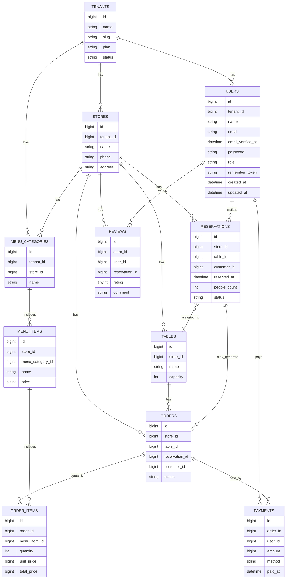

```mermaid
erDiagram
  TENANTS ||--o{ STORES : has
  TENANTS ||--o{ USERS : has
  TENANTS ||--o{ MENU_CATEGORIES : has

  STORES ||--o{ TABLES : has
  STORES ||--o{ RESERVATIONS : has
  STORES ||--o{ ORDERS : has
  STORES ||--o{ REVIEWS : has
  STORES ||--o{ MENU_CATEGORIES : has
  
  TABLES ||--o{ ORDERS : has

  USERS ||--o{ RESERVATIONS : makes
  USERS ||--o{ REVIEWS : writes
  USERS ||--o{ PAYMENTS : pays

  RESERVATIONS ||--o{ ORDERS : may_generate
  RESERVATIONS }o--|| TABLES : assigned_to

  ORDERS ||--o{ ORDER_ITEMS : contains
  ORDERS ||--o{ PAYMENTS : paid_by

  MENU_CATEGORIES ||--o{ MENU_ITEMS : includes
  
  MENU_ITEMS ||--o{ ORDER_ITEMS : includes

  TENANTS {
    bigint id
    string name
    string slug
    string plan
    string status
  }

  USERS {
    bigint id
    bigint tenant_id
    string name
    string email
    datetime email_verified_at
    string password
    string role
    string remember_token
    datetime created_at
    datetime updated_at
  }

  STORES {
    bigint id
    bigint tenant_id
    string name
    string phone
    string address
  }

  TABLES {
    bigint id
    bigint store_id
    string name
    int capacity
  }

  MENU_CATEGORIES {
    bigint id
    bigint tenant_id
    bigint store_id
    string name
  }

  MENU_ITEMS {
    bigint id
    bigint store_id
    bigint menu_category_id
    string name
    bigint price
  }

  RESERVATIONS {
    bigint id
    bigint store_id
    bigint table_id
    bigint customer_id
    datetime reserved_at
    int people_count
    string status
  }

  ORDERS {
    bigint id
    bigint store_id
    bigint table_id
    bigint reservation_id
    bigint customer_id
    string status
  }

  ORDER_ITEMS {
    bigint id
    bigint order_id
    bigint menu_item_id
    int quantity
    bigint unit_price
    bigint total_price
  }

  PAYMENTS {
    bigint id
    bigint order_id
    bigint user_id
    bigint amount
    string method
    datetime paid_at
  }

  REVIEWS {
    bigint id
    bigint store_id
    bigint user_id
    bigint reservation_id
    tinyint rating
    string comment
  }
```