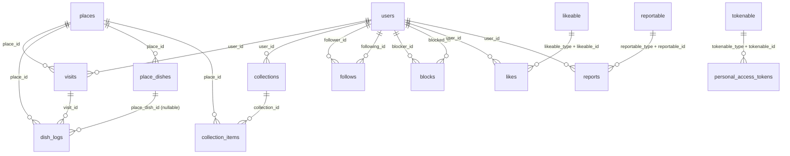

# ERD

## Overview
- Domain entities: users, places, visits, dish_logs, place_dishes, collections, collection_items
- Social entities: follows, blocks
- Moderation/engagement: likes, reports
- Infra tables: personal_access_tokens, cache, cache_locks, jobs, job_batches, failed_jobs

## Relationships 
- users 1:N visits
- places 1:N visits
- visits 1:N dish_logs
- places 1:N dish_logs
- places 1:N place_dishes
- place_dishes 1:N dish_logs (optional)
- users 1:N collections
- collections 1:N collection_items
- places 1:N collection_items
- users N:N users via follows (follower -> following)
- users N:N users via blocks (blocker -> blocked)
- users 1:N likes (polymorphic target)
- users 1:N reports (polymorphic target)
- tokenable (polymorphic) 1:N personal_access_tokens

## Mermaid ERD


## Polymorphic targets (current usage)
- likeable: visits, dish_logs, collections
- reportable: visits, dish_logs, collections
- tokenable: users

## Tables

### users
- id (PK)
- nickname (unique), email (unique), password (nullable)
- provider, provider_id (nullable, unique pair)
- avatar_url, bio (nullable)
- email_verified_at, remember_token
- timestamps, soft_deletes

### places
- id (PK)
- name
- lat, lng (nullable)
- address, road_address (nullable)
- source, source_place_id (nullable, unique pair)
- category, phone (nullable)
- timestamps, soft_deletes

### visits
- id (PK)
- user_id (FK -> users.id)
- place_id (FK -> places.id)
- visited_at
- visibility (private|followers|public)
- memo (nullable)
- published_at (nullable)
- is_hidden (default false)
- timestamps, soft_deletes

### place_dishes
- id (PK)
- place_id (FK -> places.id)
- name, name_norm
- timestamps
- unique (place_id, name_norm)

### dish_logs
- id (PK)
- visit_id (FK -> visits.id)
- place_id (FK -> places.id)
- place_dish_id (FK -> place_dishes.id, nullable)
- dish_name
- memo (nullable)
- would_reorder (default false)
- taste_salty, taste_bland, taste_sweet, taste_spicy, taste_umami, taste_texture (nullable)
- photo_url (nullable)
- sort_order (default 0)
- is_hidden (default false)
- timestamps, soft_deletes

### collections
- id (PK)
- user_id (FK -> users.id)
- title
- description, cover_url (nullable)
- share_slug (unique, nullable)
- shared_at (nullable)
- is_hidden (default false)
- timestamps, soft_deletes

### collection_items
- id (PK)
- collection_id (FK -> collections.id)
- place_id (FK -> places.id)
- sort_order (default 0)
- note (nullable)
- timestamps
- unique (collection_id, place_id)

### follows
- id (PK)
- follower_id (FK -> users.id)
- following_id (FK -> users.id)
- timestamps
- unique (follower_id, following_id)

### blocks
- id (PK)
- blocker_id (FK -> users.id)
- blocked_id (FK -> users.id)
- timestamps
- unique (blocker_id, blocked_id)

### likes
- id (PK)
- user_id (FK -> users.id)
- likeable_type, likeable_id (polymorphic)
- timestamps
- unique (user_id, likeable_type, likeable_id)

### reports
- id (PK)
- user_id (FK -> users.id)
- reportable_type, reportable_id (polymorphic)
- reason (spam|ads|abuse|illegal|other)
- detail (nullable)
- status (pending|auto_hidden|resolved|rejected)
- timestamps
- unique (user_id, reportable_type, reportable_id)

### personal_access_tokens
- id (PK)
- tokenable_type, tokenable_id (polymorphic)
- name, token (unique)
- abilities (nullable)
- last_used_at, expires_at (nullable)
- timestamps

### cache
- key (PK)
- value
- expiration

### cache_locks
- key (PK)
- owner
- expiration

### jobs
- id (PK)
- queue
- payload
- attempts
- reserved_at, available_at, created_at

### job_batches
- id (PK)
- name
- total_jobs, pending_jobs, failed_jobs
- failed_job_ids
- options (nullable)
- cancelled_at, created_at, finished_at (nullable)

### failed_jobs
- id (PK)
- uuid (unique)
- connection, queue
- payload, exception
- failed_at
```
